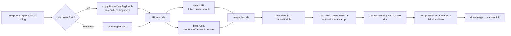

# Canvas decode pipeline audit (Research Round 5)

**Probe:** `node __localtests__/fo-decode-pipeline-audit.mjs` (headed Chrome)  
**Artifact:** `.sandbox-edit/decode-pipeline-audit.json`

Deep dive on the **canvas rasterizing path only** — `src/exporters/toCanvas.js` and `__localtests__/fo-fix-toCanvas.js`. Compares **product-baseline** vs **w7** (`tc-fix-w7-rfork-fo-y-half-leading-meta`).

---

## Pipeline trace (SVG → bitmap)



### Stage notes

| Stage | Product (`toCanvas.js`) | Lab (`fo-fix-toCanvas.js`) |
|-------|-------------------------|----------------------------|
| **URL** | Accepts `data:` or `blob:`; runner uses **blob:** for readable canvas | Re-encodes forked SVG to **data:** before decode |
| **Pre-decode** | Safari box-shadow→drop-shadow; optional `experimentalRasterSvgPatch` | Same patch hook via `labToCanvasOpts.rasterOnlySvgPatch` |
| **Decode** | `img.decode()` (+ optional settle/double-decode/RAF) | Same + `loadLabRasterSource` pipelines when set |
| **Dims** | `refW/H` ← `meta.w0/h0` or natural; `outW/H` ← opts × scale; backing `round(out×dpr)` | + lab knobs: `backingRound`, `outDimsRound`, `ctxScale`, `drawDest` |
| **drawImage** | `computeRasterDrawRect` → 9-arg if gbcr or natural-dims; else 5-arg | `drawMain`: gbcr only if `vDriftFix` or `measuredDest`; default **no gbcr nudge** |

---

## Meta flowing to draw

Captured in `capture.js` / `parseCaptureMeta()` / `enrichRasterMetaFromTextLeaf()`:

| Field | Source | Used in draw |
|-------|--------|--------------|
| `w0`, `h0` | SVG root or capture rect | Reference size when opts width/height set |
| `gbcrFracX`, `gbcrFracY` | Fractional part of root GBCR | **Product:** `dx -= gbcrFracX`, `dy -= gbcrFracY` when both finite |
| `inkTopFracInBorder`, `inkTopFracExpected`, `inkRefBorderH` | Live Range vs cap-model (`experimentalCaptureInkMeta`) | `rasterInkAlignDestDy` when `experimentalRasterInkAlign` |
| `lhStrutHalfLeadingPx`, `lhStrutLineHeightPx`, `lhStrutFontSizePx` | Live text leaf | **SVG fork** `fo-y-half-leading-meta` (−½(lh−fs) on FO y); lab `inkOffsetFromFoTop` |
| `inkTopOffsetFromFoTop` | Range top − cap-model top | Lab `inkOffsetFromFoTop` → `dy -= offset` |
| `lhStrutRangeSubpixelPx` | Range subpixel fraction | Lab `strutRangeSubpixelDrawDy` |
| `dpr`, `scale` | Export options | Backing store + paint box; not stored in meta object |

**GBCR nudge vs matrix baseline:** `product-baseline` in the FO lab uses `rasterSvgUrl` (data URL, **no** gbcr draw nudge). Production `snapdom.toCanvas` **does** apply −gbcrFrac. The audit runs **both** paths explicitly.

---

## Where half-leading can enter (besides FO y)

1. **FO y patch (w7)** — `foreignObjectYNudgePatch(svg, -lhStrutHalfLeadingPx)` at decode time. Primary structural fix (~2.797 → ~0.203 px canvasΔ).
2. **FO internal layout** — serialized `line-height` inside FO; affects bitmap paint origin during decode, not `drawImage` dy.
3. **Product gbcrFracY nudge** — subpixel viewport fraction (~0–1 px), not strut-sized.
4. **`experimentalRasterInkAlign`** — `dy += (measuredFrac − expectedFrac) × borderH × scale`; cap-model half-leading, not FO y.
5. **Lab `inkOffsetFromFoTop`** — `dy -= inkTopOffsetFromFoTop` or `−lhStrutHalfLeadingPx`.
6. **Lab `strutRangeSubpixelDrawDy`** — Range fractional px after FO y patch.
7. **`experimentalRasterNaturalDims`** — contain-centering adds `dy = (paintH − dh) / 2`.
8. **Backing round vs exact** — `round(out×dpr)` vs fractional paint box (vdrift class ~1 px, not 2.8).

---

## Probe output (natural vs dest vs FO attrs)

The audit logs per variant:

- **SVG attrs:** `<svg width/height/viewBox>`, `<foreignObject x/y/width/height>` pre/post patch
- **Decode:** `naturalWidth/height` from data URL and blob URL decode
- **Computed draw:** product + lab dim chains and dest rects
- **Actual draw:** hooked `drawImage` args during real raster
- **Three-way ink:** live vs inline FO vs canvas (via `runFoFixProbe`)

---

## Key commands

```bash
npm run compile && node __localtests__/fo-decode-pipeline-audit.mjs
node __localtests__/fo-decode-pipeline-audit.mjs --dpr 1 --landmark Home
```

Related: [`README-FO-RASTER-RESEARCH.md`](README-FO-RASTER-RESEARCH.md) · [`vdrift-root-cause-probe.mjs`](vdrift-root-cause-probe.mjs) (gbcr draw nudge only)
